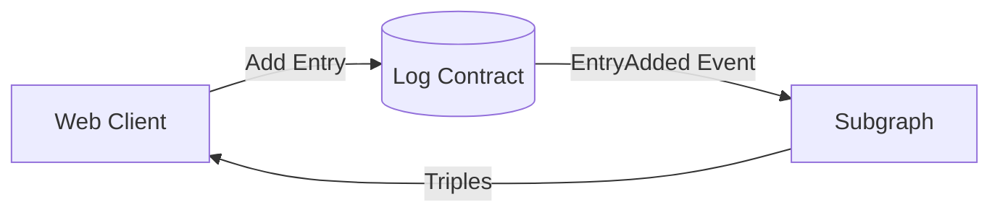

# Geogenesis

Summary

## Architecture



## Setup

### Install dependencies

- node version (18+)
- pnpm (version 7+)
- Docker

  - mac: https://docs.docker.com/desktop/install/mac-install/

### Frontend

- pnpm install
- pnpm build

### Backend

- pnpm docker

### Structure

- apps/
- packages/

### Package descriptions

- web
- contracts
- database

### Using the monorepo

- Installing. What happens when you install?
- Building all dependencies
- Running commands in specific directories using pnpm --filter
- Using nx/turbo/whatever

## Deployment

### Web app

The Geogenesis web app is hosted on Vercel. Check out the [live site here](https://geogenesis.vercel.app).

### Staging backend

We deploy a custom staging backend using our `docker-compose.yml` and `docker-compose.prod.yml`. These are deployed on [Okteto](https://www.okteto.com/).

To deploy:

```bash
okteto build
oktetu up
```

## CI/CD

We run our CI/CD through Github actions: https://github.com/baiirun/geogenesis/actions
