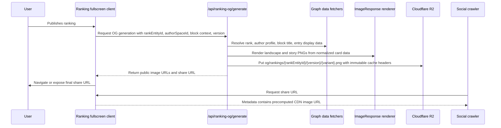
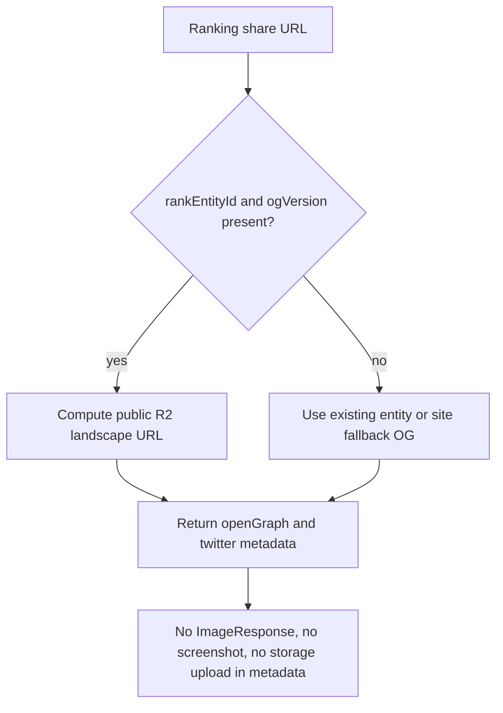

# feat: Add ranking OG social images

## Summary

Add custom social-share images for ranking fullscreen pages by generating deterministic landscape and portrait images from ranking data, uploading them to Cloudflare R2 behind a custom public base URL, and making ranking metadata return only the precomputed landscape URL. The share URL must identify the submitted Rank entity so crawlers and logged-out viewers can resolve "My [ranking]" without relying on client wallet state.

---

## Problem Frame

Ranking fullscreen pages currently render from a client-only route at `apps/web/app/space/(entity)/[id]/[entityId]/ranking-compose/page.tsx`, and existing OG image routes in `apps/web/app/opengraph-image.tsx`, `apps/web/app/space/[id]/opengraph-image.tsx`, and `apps/web/app/space/(entity)/[id]/[entityId]/opengraph-image.tsx` mostly wrap static or entity cover images through `apps/web/core/opengraph.tsx`. That is not enough for a personalized "My [ranking]" share card because the current fullscreen URL does not include a public rank identifier, and the current client hooks derive the user's ranking from the active wallet.

The desired design should follow the energy of `docs/images/wrapup.png`: a playful ranked-list social card with a top profile signal, but adapted to Geo's white, purple, pink, and crisp interface language. Generation must happen outside metadata/page rendering, with the final image served as a static CDN URL.

---

## Requirements

- R1. Ranking share URLs include a stable public rank identity so the same URL resolves the same author's ranking for crawlers, logged-out users, and signed-in users.
- R2. Generated variants include a primary retina landscape Open Graph card at 2400x1260 and a portrait story card at 1080x1920, both rendering "My [ranking name]" with the author's profile info, avatar or deterministic avatar fallback, period metadata when present, and the top ranked entries with names and thumbnail fallbacks.
- R3. The cards use a Geo-specific visual treatment: white base, purple/pink accents, playful wrapped-style background shapes, readable rank rows, and no dependence on screenshotting the live page.
- R4. Image generation runs out-of-band from `generateMetadata()` and page rendering; metadata only returns a static URL that is already knowable from URL params and environment config.
- R5. Generated images upload to Cloudflare R2-compatible object storage through server-only env config and are served from a custom public base URL, not an `r2.dev` production URL.
- R6. Object keys are versioned and immutable so social-preview caches can be bypassed by changing the URL when preview-affecting data changes.
- R7. The publish/share flow handles image readiness by generating the card before presenting or navigating to the final share URL, with a fallback when generation fails.
- R8. The implementation has focused unit coverage for URL construction, rank data extraction, card input normalization, storage key generation, route behavior, and metadata output.

---

## Key Technical Decisions

- **Use Cloudflare R2 as the storage target:** Store generated ranking images in Cloudflare R2 through its S3-compatible API, using server-only env vars and a custom public base URL.
- **Make `rankEntityId` and `authorSpaceId` part of the public share URL:** The correct ranking identifier is the submitted Rank entity ID. Current publish code receives it as `result.id` from `Ops.ranks.create()` or `geo.ranks.update()`, and the existing "my ranking" fetch later exposes the same value as `myRankEntity.id`. This is distinct from `blockEntityId`, which identifies the ranking block being composed; `relationId`, which identifies the block placement; and `parentEntityId`, which identifies the containing page.
- **Use deterministic image URLs instead of a stored URL column:** The app does not currently have a page-row database for `og_image_url`. Use variantized immutable keys such as `og/rankings/{rankEntityId}/{version}/landscape.png` and `og/rankings/{rankEntityId}/{version}/story.png` with `CLOUDFLARE_R2_PUBLIC_BASE_URL` so metadata can compute the final landscape URL without generation or storage reads.
- **Generate both landscape and story variants, but keep metadata landscape-only:** Open Graph and Twitter/X previews should point at the 2400x1260 landscape image, preserving the standard 1.91:1 preview ratio at higher pixel density without oversized files. Instagram-style portrait sharing should use the 1080x1920 story image as a downloadable or native Web Share file; do not add the portrait image to `og:image` because link-preview crawlers expect the landscape card. Defer a 1080x1350 feed variant until there is a concrete feed-post workflow.
- **Only publish personalized metadata URLs after generation succeeds:** Because `generateMetadata()` should not check R2 existence, the share URL should include `rankEntityId` and `ogVersion` only after the landscape object is confirmed uploaded or already present. If generation fails, navigate or expose a non-personalized fullscreen URL without those metadata-enabling params so crawlers receive the inherited fallback OG image instead of a 404 R2 URL.
- **Generate via `ImageResponse` in server code, then upload the PNG bytes:** The app already uses `next/og` in `apps/web/core/opengraph.tsx`. A new ranking-specific renderer should support explicit `landscape` and `story` variants, use flexbox and absolute positioning only, and keep bundled assets small.
- **Do not reuse entity media upload flows:** Existing media uploads go through IPFS/SDK paths for graph entities. OG cards are derived artifacts and should use a server-only R2 client with credentials never exposed to the browser.
- **Keep the first implementation idempotent rather than queue-heavy:** A same-origin generation API can render and upload immediately after publish. The storage key and version make retries safe. A separate queue can be added later if production traffic shows the generation route is too slow or bursty.

---

## High-Level Technical Design

---

## Scope Boundaries

- In scope: ranking fullscreen share identity, data-rendered landscape and story image generation, R2 upload, deterministic CDN URLs, metadata wiring, publish-flow readiness, portrait share/download affordances, and focused tests.
- Out of scope: browser screenshots, Cloudflare Browser Rendering, Playwright screenshot capture for OG generation, and replacing all non-ranking OG images.
- Out of scope: production queue infrastructure. The route must be idempotent so Vercel Queues, Cloudflare Queues, Inngest, or Trigger.dev can be layered in later.

### Deferred to Follow-Up Work

- Add a queue-backed bulk regeneration system if immediate generation during publish becomes a latency or reliability issue.
- Add lifecycle cleanup for old R2 objects after the first versioned-key rollout proves stable.
- Add a 1080x1350 feed-post variant if the product later needs a dedicated Instagram feed or LinkedIn image export flow.
- Migrate existing entity and space OG images from 600x315 static wrappers to the new 1.91:1 retina landscape export system if this card performs well.

---

## Implementation Units

### U1. Public Share URL and Metadata Shell

- **Goal:** Convert the ranking compose page into a server shell that can export `generateMetadata()` while preserving the existing client experience.
- **Requirements:** R1, R4, R6
- **Dependencies:** None
- **Files:**
  - `apps/web/app/space/(entity)/[id]/[entityId]/ranking-compose/page.tsx`
  - `apps/web/app/space/(entity)/[id]/[entityId]/ranking-compose/ranking-compose-client-page.tsx`
  - `apps/web/core/blocks/ranking/ranking-compose-url.ts`
  - `apps/web/core/blocks/ranking/ranking-compose-url.test.ts`
- **Approach:** Move the current client component body into a new client-only file, keep `page.tsx` as a server component, and add optional URL fields for `rankEntityId`, `authorSpaceId`, and `ogVersion`. `generateMetadata()` should validate params, build the canonical ranking share URL, and return ranking-specific `openGraph.images` and `twitter.images` only when it has enough information to compute the landscape CDN URL.
- **Patterns to follow:** Existing metadata shape in `apps/web/app/space/(entity)/[id]/[entityId]/layout.tsx`; existing URL helper style in `apps/web/core/blocks/ranking/ranking-compose-url.ts`; root metadata defaults in `apps/web/app/layout.tsx`.
- **Test scenarios:**
  - `rankingComposeHref()` preserves existing edit and view URLs when no rank params are passed.
  - `rankingComposeHref()` includes `rankEntityId`, `authorSpaceId`, and `ogVersion` for share URLs without dropping `relationId`, `parentEntityId`, or date params.
  - Metadata falls back to the inherited entity/site image when rank params are missing or invalid.
  - Metadata returns the deterministic ranking OG URL, 2400 width, 1260 height, alt text, and `summary_large_image` Twitter card when rank params are valid.
- **Verification:** The route still renders edit and view modes through the client page, and metadata can be reasoned about from URL params and env config only.

### U2. Server-Side Ranking OG Data Fetcher

- **Goal:** Add a server-side data layer that turns a public Rank entity ID into normalized card data for rendering and metadata copy.
- **Requirements:** R1, R2, R7, R8
- **Dependencies:** U1
- **Files:**
  - `apps/web/core/blocks/ranking/ranking-og-data.ts`
  - `apps/web/core/blocks/ranking/ranking-og-data.test.ts`
  - `apps/web/core/blocks/ranking/my-ranking-entity.ts`
  - `apps/web/core/blocks/ranking/ranking-block-relations.ts`
  - `apps/web/core/blocks/ranking/ranking-rankable-list.ts`
- **Approach:** Build a server helper that fetches the Rank entity by `rankEntityId`, verifies it was submitted to the target block, reads ordered vote relations with `getMyRankingOrderedEntityIds()`, fetches the top entry entities, and resolves author profile data from `authorSpaceId`. Normalize missing data into explicit fallbacks: "Untitled ranking", "Anonymous curator", generated avatar seed, blank thumbnails, and up to five ranked entries.
- **Patterns to follow:** Existing rank relation parsing in `apps/web/core/blocks/ranking/my-ranking-entity.ts`; entity display extraction in `apps/web/core/blocks/ranking/use-ranking-entry-entities.ts`; cached fetch patterns in `apps/web/app/space/(entity)/[id]/[entityId]/cached-fetch-entity.ts`.
- **Test scenarios:**
  - A rank entity with ordered vote relations produces top entries in stored relation order.
  - A rank entity not submitted to the requested block is rejected and does not generate a personalized image.
  - Missing author profile data falls back to a deterministic name/avatar seed without throwing.
  - Empty rankings produce a valid card data object with an empty-list state rather than a route error.
  - Period labels are included only when `rankingStartDate` or `rankingEndDate` is present.
- **Verification:** The renderer receives a small serializable object and does not need React client hooks, wallet state, or local drafts.

### U3. Ranking OG Card Renderer

- **Goal:** Create a Geo-specific `ImageResponse` renderer for the ranking card.
- **Requirements:** R2, R3, R8
- **Dependencies:** U2
- **Files:**
  - `apps/web/core/blocks/ranking/ranking-og-image.tsx`
  - `apps/web/core/blocks/ranking/ranking-og-image.test.tsx`
  - `apps/web/app/api/ranking-og/preview/route.tsx`
- **Approach:** Render from a 1200x630 landscape design base into a 2400x1260 PNG, plus a 1080x1920 story card from the same normalized data. Use `ImageResponse`-safe layout primitives: flexbox, absolute positioning, simple border radii, nested images, and text wrapping. Do not use CSS grid because `ImageResponse` only supports a subset of CSS. If brand font fidelity is required, add or source a supported `ttf`, `otf`, or `woff` font; the existing app fonts are `woff2`, which should not be assumed to work in `ImageResponse`.
- **Patterns to follow:** Existing `ImageResponse` use in `apps/web/core/opengraph.tsx`; app color tokens in `apps/web/design-system/theme/colors.ts`; current app font locations in `apps/web/app/fonts/`; visual reference at `docs/images/wrapup.png`.
- **Test scenarios:**
  - Renderer returns a PNG response with 2400x1260 dimensions for the `landscape` variant.
  - Renderer returns a PNG response with 1080x1920 dimensions for the `story` variant.
  - Long ranking titles and long entry names are truncated or wrapped within their row bounds.
  - Missing thumbnails use a styled placeholder and do not collapse row layout.
  - Author avatar missing state uses a deterministic fallback and still renders a profile strip.
  - Empty ranking data renders a polished empty-state card instead of a broken list.
- **Verification:** A local preview route can render sample data and real rank data for both variants, and the resulting cards remain readable at social-preview thumbnail sizes and story-preview sizes.

### U4. Cloudflare R2 Upload and Generation API

- **Goal:** Add server-only storage config, idempotent upload, and a generation route that renders and stores the PNG out-of-band.
- **Requirements:** R4, R5, R6, R7, R8
- **Dependencies:** U2, U3
- **Files:**
  - `apps/web/core/blocks/ranking/ranking-og-storage.ts`
  - `apps/web/core/blocks/ranking/ranking-og-storage.test.ts`
  - `apps/web/app/api/ranking-og/generate/route.tsx`
  - `apps/web/app/api/ranking-og/generate/route.test.ts`
  - `apps/web/package.json`
- **Approach:** Add a server-only R2 client using Cloudflare's S3-compatible endpoint. Required env should include account id, access key id, secret access key, bucket name, and public base URL. Build keys as `og/rankings/{rankEntityId}/{version}/{variant}.png`, check for existing objects before upload, and put with `Content-Type: image/png` plus `Cache-Control: public, max-age=31536000, immutable`. Gate the route with same-origin checks and the existing member/rate-limit posture used by write APIs, then allow an optional server secret for admin backfills.
- **Patterns to follow:** Same-origin and write authorization structure in `apps/web/app/api/chat/authorize-write/route.ts`; package dependency management in `apps/web/package.json`; Effect-free route handlers where simple request validation is enough.
- **Test scenarios:**
  - Missing required R2 env returns a typed configuration error and does not attempt upload.
  - Storage key generation normalizes ids, includes version and variant, and never overwrites the same URL for changed content.
  - Existing object short-circuits upload and returns the same public URL.
  - Successful generation calls the renderer for the requested variants, uploads each missing object once, and returns `{ imageUrls, shareUrl, keys }`.
  - Cross-origin requests are rejected in production mode.
  - Invalid `rankEntityId`, `authorSpaceId`, or block context returns 400 instead of generating a misleading fallback.
- **Verification:** The route is safe to retry and can be called repeatedly for the same rank/version without producing duplicate objects.

### U5. Publish Flow, Shared Viewing, and Readiness

- **Goal:** Wire generation into ranking publish, make shared rank URLs useful for viewers who are not the author, and expose the portrait story asset where it is useful.
- **Requirements:** R1, R2, R7, R8
- **Dependencies:** U1, U4
- **Files:**
  - `apps/web/core/blocks/ranking/use-ranking-submissions.ts`
  - `apps/web/core/blocks/ranking/ranking-og-version.ts`
  - `apps/web/core/blocks/ranking/ranking-og-version.test.ts`
  - `apps/web/partials/blocks/table/ranking-compose-screen.tsx`
  - `apps/web/partials/blocks/table/use-ranking-block-state.ts`
  - `apps/web/partials/blocks/table/ranking-table-view.tsx`
  - `apps/web/core/blocks/ranking/ranking-compose-url.ts`
- **Approach:** Change the publish path so `saveMySubmission()` returns the Rank entity ID and author space ID instead of only `true`. Compute an `ogVersion` from preview-affecting inputs: rank entity ID, ordered entity IDs, ranking name, period dates, author profile fields, and layout version. After publish and indexer readiness, call the generation API, then navigate to a `mode=view` share URL that includes `rankEntityId`, `authorSpaceId`, and `ogVersion`. When a shared rank entity ID is present, the fullscreen view should display that public submitted ranking as the personalized ranking rather than relying on the current wallet's `mySubmission`. Add share controls for the story image: use `navigator.canShare({ files })` and `navigator.share({ files })` when supported, and fall back to downloading the 1080x1920 PNG.
- **Patterns to follow:** Existing post-publish rank polling in `apps/web/core/blocks/ranking/use-ranking-submissions.ts`; existing `mode=view` navigation in `apps/web/partials/blocks/table/ranking-compose-screen.tsx`; ranking display state in `apps/web/partials/blocks/table/use-ranking-block-state.ts`.
- **Test scenarios:**
  - Publishing a new rank returns rank identity data and triggers OG generation after the rank exists in the indexer.
  - Updating an existing rank changes `ogVersion` when ordered ids change and preserves it when preview data is unchanged.
  - Generation failure still navigates to the fullscreen view, but omits `rankEntityId` and `ogVersion` from the public share URL so metadata falls back to the inherited entity/site image.
  - A logged-out/shared viewer with `rankEntityId` sees the shared author's ranking instead of an empty "my ranking" state.
  - A signed-in author without `rankEntityId` keeps the existing current-wallet ranking behavior.
  - Story sharing uses the native Web Share file path when supported and degrades to download when unsupported.
  - The portrait story image is never used as the metadata `og:image`; metadata remains tied to the landscape variant.
- **Verification:** The first share URL copied or reached after publish has enough information for crawlers to resolve the image without waiting on client state.

### U6. Operational Backfill and Documentation

- **Goal:** Make regeneration and environment setup repeatable for existing rankings and production operations.
- **Requirements:** R5, R6, R7
- **Dependencies:** U4, U5
- **Files:**
  - `apps/web/scripts/generate-ranking-og.ts`
  - `apps/web/core/blocks/ranking/ranking-og-backfill.ts`
  - `apps/web/core/blocks/ranking/ranking-og-backfill.test.ts`
  - `apps/web/README.md`
- **Approach:** Add a small Bun-compatible script that accepts Rank entity IDs or a JSON input list, calls the same server-side generation helpers, and supports dry-run output of keys and URLs for selected variants. Document required env vars, custom-domain expectations, immutable-key behavior, landscape metadata behavior, story sharing behavior, and the fallback path. Keep broad queue orchestration out of this unit; this is a manual/batch regeneration affordance that uses the same idempotent primitives as publish-time generation.
- **Patterns to follow:** Root Bun workspace scripts in `package.json`; app-local documentation style in `apps/web/README.md`.
- **Test scenarios:**
  - Dry-run mode returns expected keys and URLs without calling storage.
  - Duplicate rank/version inputs are deduped before generation.
  - Invalid rank entity IDs are reported per item while valid items continue in the batch.
  - Backfill uses the same `ogVersion` and storage-key helpers as publish-time generation.
- **Verification:** Operators can set env, preview URLs, and regenerate a targeted set of ranking cards without touching the user-facing app.

---

## Acceptance Examples

- AE1. Given a user publishes "Best public goods projects" with five ranked entries, when publish completes, the app generates landscape and story PNGs, uploads them to `CLOUDFLARE_R2_PUBLIC_BASE_URL/og/rankings/{rankEntityId}/{version}/landscape.png` and `CLOUDFLARE_R2_PUBLIC_BASE_URL/og/rankings/{rankEntityId}/{version}/story.png`, and navigates to a share URL containing `rankEntityId`, `authorSpaceId`, and `ogVersion`.
- AE2. Given a crawler requests the share URL, when `generateMetadata()` runs, it returns the static CDN image URL and does not call `ImageResponse`, Playwright, screenshot tooling, or R2 upload code.
- AE3. Given the same rank is regenerated with unchanged preview data, when the generation API runs again, it returns the existing public URL without rewriting the object.
- AE4. Given the author reorders their ranking, when the new share URL is generated, `ogVersion` changes and the metadata image URL changes with it.
- AE5. Given a logged-out user opens a share URL with a valid `rankEntityId`, when the fullscreen page renders, it shows the shared author's submitted ranking rather than an empty current-wallet ranking.
- AE6. Given a user taps "share story" for a generated ranking, when the browser supports file sharing, the app invokes native Web Share with the 1080x1920 image; otherwise it downloads the story PNG so the user can post it to Instagram or another portrait-first surface.

---

## Risks & Dependencies

- **Font support:** `ImageResponse` documentation lists `ttf`, `otf`, and `woff` support. The app's current Calibre files are `woff2`, so font loading needs verification or a supported font asset.
- **Metadata inheritance:** The ranking route sits under the entity route, which already has entity metadata and an `opengraph-image.tsx`. Page-level metadata must intentionally override images for share URLs and fall back cleanly otherwise.
- **Public data boundary:** A shared rank card should only include public rank, profile, and entity data. Do not include wallet-only, local-draft, or private client state.
- **Indexer timing:** The publish flow already polls for rank existence. OG generation should run after that readiness signal or use the known publish payload as a temporary source of truth and then tolerate a later indexer fetch.
- **Instagram sharing constraints:** Instagram will not use a portrait `og:image` from a normal link preview. The portrait asset should be treated as exported media for native Web Share or download, with platform-specific direct story integrations left for later if needed.

---

## Documentation / Operational Notes

- Required production storage should use a Cloudflare custom domain, for example `https://img.geobrowser.io`, configured as `CLOUDFLARE_R2_PUBLIC_BASE_URL`.
- Server-only env should not live in `NEXT_PUBLIC_*` variables and should not be imported from client components.
- Suggested env names:
  - `CLOUDFLARE_R2_ACCOUNT_ID`
  - `CLOUDFLARE_R2_ACCESS_KEY_ID`
  - `CLOUDFLARE_R2_SECRET_ACCESS_KEY`
  - `CLOUDFLARE_R2_BUCKET`
  - `CLOUDFLARE_R2_PUBLIC_BASE_URL`
  - `INTERNAL_API_SECRET` for script or admin-triggered backfills only
- The first layout version should be encoded into `ogVersion` as a constant so visual changes can force regeneration without changing rank data.
- Metadata should always compute `og/rankings/{rankEntityId}/{ogVersion}/landscape.png`; portrait story images are for explicit share/download flows.

---

## Sources & Research

- Repo patterns:
  - `apps/web/core/opengraph.tsx` for existing `ImageResponse` wrapping.
  - `apps/web/app/space/(entity)/[id]/[entityId]/ranking-compose/page.tsx` for the current client-only fullscreen route.
  - `apps/web/core/blocks/ranking/use-ranking-submissions.ts` for rank publish, author data, and indexer polling.
  - `apps/web/core/blocks/ranking/my-ranking-entity.ts` for rank entity filtering and ordered vote parsing.
  - `apps/web/partials/blocks/table/use-ranking-block-state.ts` for current wallet-derived "my ranking" display behavior.
  - `docs/images/wrapup.png` for the requested wrapped-style visual reference.
- External references:
  - Next.js `generateMetadata`: https://nextjs.org/docs/app/api-reference/functions/generate-metadata
  - Next.js `opengraph-image` file convention: https://nextjs.org/docs/app/api-reference/file-conventions/metadata/opengraph-image
  - Next.js `ImageResponse`: https://nextjs.org/docs/app/api-reference/functions/image-response
  - Vercel OG image generation: https://vercel.com/docs/og-image-generation
  - Cloudflare R2 public buckets and custom domains: https://developers.cloudflare.com/r2/buckets/public-buckets/
  - Cloudflare R2 cache with custom domains: https://developers.cloudflare.com/cache/interaction-cloudflare-products/r2/
  - Cloudflare R2 S3 API compatibility: https://developers.cloudflare.com/r2/api/s3/api/
  - Cloudflare R2 authentication: https://developers.cloudflare.com/r2/api/tokens/
  - MDN Web Share API: https://developer.mozilla.org/en-US/docs/Web/API/Web_Share_API
  - MDN `navigator.canShare()`: https://developer.mozilla.org/en-US/docs/Web/API/Navigator/canShare
