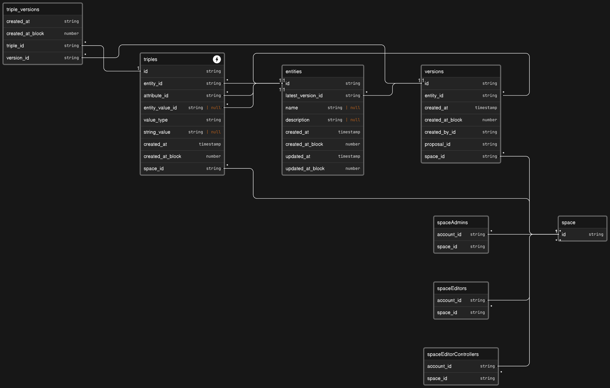

# What is Geo?

Geo is two things: 1) the protocol, and 2) Geo Genesis, a dApp.

At it's core, the Geo protocol is a worldwide, public, decentralized graph database built with Polygon, IPFS, and a data service deployed on The Graph Horizon. Geo enables us to curate the world's public knowledge in a trustless, decentralized, transparent way.

The Geo Genesis dApp is meant to be the best interface for interacting with the public knowledge in the Geo protocol.

### Data model

Knowledge in Geo are organized into an ["Entity"](./01-entities.md), a uniquely identifiable data structure that is referenced by ["Triples"](02-triples.md).

A [Triple](02-triples.md) is a data structure composed of three elements: an [Entity](01-entities.md) identifier, an [Attribute](03-attributes.md) identifier, and a [Value](04-values.md) identifier. We'll discuss [Attributes](03-attributes.md) and [Values](04-values.md) in other docs.

Composing these identifier references between entities and triples creates the graph of information in Geo.

Triples are organized and scoped into [Spaces](06-spaces.md). A Space is a smart contract that tracks data added to the knowledge graph via an append-only log of [IPFS](https://ipfs.tech/) [content identifiers](https://docs.ipfs.tech/concepts/content-addressing) (CIDs). The Geo knowledge graph is comprised of many spaces, each tracking their own set of data. Triples in Geo can reference entities from any Space. Additionally, spaces control their own governance and permissions behavior.

