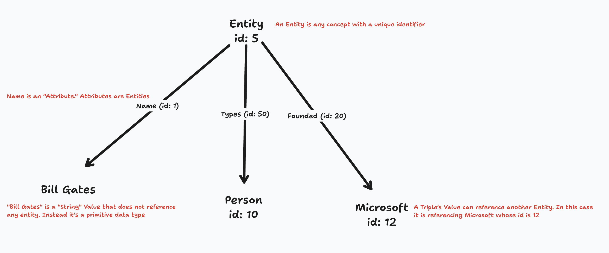

# Entities

An Entity is any concept in the Geo knowledge graph. It can be a person, an event, an idea, a date, or anything, such a Bill Gates, or United States of America, Ethereum, or January 9th. The only required property of an Entity is that it has a globally unique identifier. The information about an Entity is defined by the Triple referencing the Entity's ID.

> For example, the Entity ID for Bill Gates might be `5`, with several triples referencing this ID. There might be a triple defining the name of the entity, the date of birth of the entity, and more.

In a graph database you can think of an Entity as a node, and Triples as the edges. In a relational database you can think of an Entity as a row, with each column being an Attribute and each value being a Triple's value – we'll cover Schemas in Geo in another document.

## System entities

Since Geo is essentially a large, user-programmed graph database, there are many Entities that are defined by the Geo protocol itself that are used for system-level behavior. For example, the `Blocks` entity is an attribute that defines the identifiers for the rich text blocks used on an page.

## Implementation

In the Geo data service we map these knowledge graph concepts to a relational database using PostgreSQL. We store a large table of triples that each reference an [Entity ID](https://github.com/geobrowser/geogenesis/blob/bf51df1309f412de957942e0405400163f92878e/packages/substream/src/sql/initPublic.sql#L114). See [Triples](02-triples.md) for more information.

[Here's a link to the Entities schema in the Geo data service](https://github.com/geobrowser/geogenesis/blob/bf51df1309f412de957942e0405400163f92878e/packages/substream/src/sql/initPublic.sql#L21).
