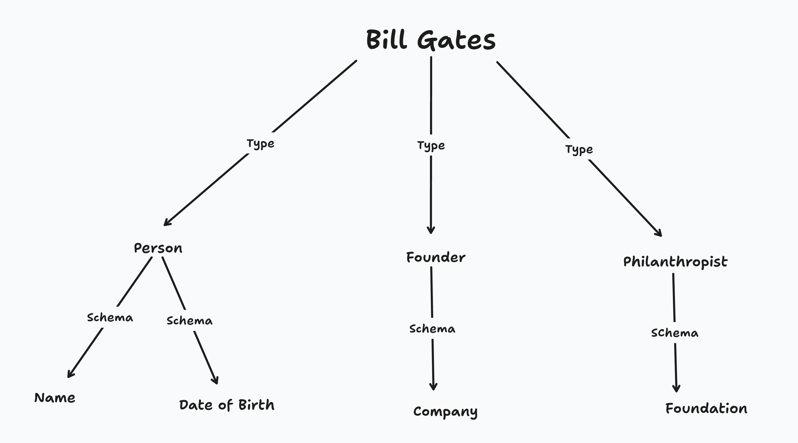

# Types

A Type in the Geo knowledge graph is an [Entity](01-entities.md) that describes what another Entity _is_. An Entity can have one or many types, and the types describe the "shape" of the Entity's data.

For example, Bill Gates might have the `Person` type as well as the `Founder` type. Each of these types might define an expected shape for the data in Bill Gates.

## Schemas

In the above example, Bill Gates has three types: Person, Founder, and Philanthropist. Additionally, each type defines a schema that it expects Entities of that type to have. For example, the Person type expects that any Entity that is type `Person` to have a Name and a Date of Birth.

**An important note is that Geo doesn't validate any schemas**. Schema attributes are optional in an Entity and mostly exist to provide hints as to how people should structure and curate data in the knowledge graph.
